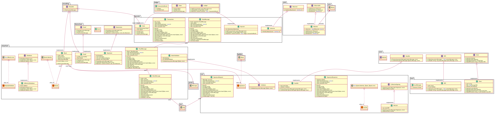

# DEDIS framework splitted in modules

The purpose of this repository is to give a hint of how the Cothority
framework could be better split into smaller modules. Each module should
be more easily replacable, which is currently not the case. Indeed,
right now changing part of the framework is nearly impossible without
changes from top to bottom, all due to the evolution of cothority that
eventually led us with plate of spaghetti code. (We love spaghetti
though!)

This modularization will be helpful when planning student projects (PhD
students too) as they will be able to focus on one or few modules at a
time. It would also help the creation of a unit test suite that could
replace the current Travis workflow to bring it down to a few minutes
duration instead of an hour.

## The Big Picture

Each module provides a public API that other modules can use and that's it, no
access to the internal logic.

In the current design we plan 4 modules:

- DARC
- Smart Contract
- Ledger (implementation: Byzcoin)
- Blockchain (implementation: Skipchain)

With the following flow of interaction:

```
             USER
              |
              v
[DARC] <-- [Ledger] --> [Smart Contract]
              |
              v
         [Blockchain]
```

## Blockchain

The Blockchain module is essentially just a secure distributed storage.
Thus, the only actions needed are a store and get (with proof) function.
Of course the implementation of the interface will have some
requirements like a validation function but this is not related to the
API, but to the instantiation.

As the blockchain is used by the Ledger module, it provides the
following interface:

```go
// Proof is the interface that provides the primitives to verify that a
// block is valid w.r.t. the genesis block.
type Proof interface {
	// Payload returns the data of the latest block.
	Payload() proto.Message

	// Verify makes sure that the integrity of the block from the genesis block
	// is correct.
	Verify() error

	Pack() proto.Message
}

// Blockchain is the interface that provides the primitives to interact with the
// blockchain.
type Blockchain interface {
	// Store stores any representation of a data structure into a new block.
	// The implementation is responsible for any validations required.
	Store(data proto.Message) error

	// GetProof returns a valid proof of the latest block.
	GetProof() (Proof, error)

	// Watch takes an observer that will be notified for each new block
	// definitely appended to the chain.
	Watch(ctx context.Context, obs utils.Observer)
}
```

## Ledger

The ledger module needs to provide a function to add a transaction to the chain
and a way to get past/current states with the proof and observe what is happening
on the chain.

Internally, those modules are using other modules like a global state storage
module that can be used to either update or read the global state. The
implementation can decide how it is stored. Another module is needed for the
access control (think about DARCs).

The repository tries to enlight those aspects by showing that it is possible
to split the framework with a bit of work.

As the Ledger module is used by the user, it provides the following
interface:

```go
// State is a verifiable value stored in the chain.
type State interface {
	Value() []byte
	Verify() error
	Pack() proto.Message
}

// Ledger is the interface that provides primitives to update a public ledger
// through transactions.
type Ledger interface {
	AddTransaction(tx proto.Message) error
	GetState(key string) (State, error)
	Watch(ctx context.Context) <-chan TransactionResult
}
```

## Overlay Network

For instance, in the case of the overlay network module, instead of
having to declare services and then protocols, the module provides the
creation of RPCs in multiple namespaces so that they interact with their
pair in each node in the sense that a given RPC will receive messages
from the same instance replicated on each node, and sending messages the
same way. No intermodules communication. Then, each RPC can be called
either on multiple peers or on a single one. Think about CoSi: The
overlay takes care of gathering the replies in an optimize way to every
online node.

## Class diagram


